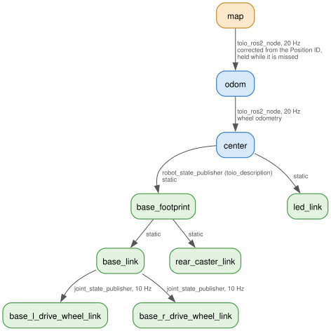

# toio_ros2

## Introduction

`toio_ros2` is ROS 2 package for using [toio](https://toio.io/).


## Requirements

### Hardware

- toio Core Cube
- toio play mat
  - Please see <https://toio.github.io/toio-spec/en/docs/hardware_position_id>.

### Software

I checked this package on the following environment.

- Ubuntu 24.04
- ROS 2 Jazzy
- toio.py 1.10.0

## Build

```bash
mkdir -p ~/dev_ws/src
cd ~/dev_ws/src
git clone https://github.com/atinfinity/toio_description.git
git clone https://github.com/atinfinity/toio_msgs.git
git clone https://github.com/atinfinity/toio_ros2.git
cd ..
rosdep install -y -i --from-paths src
colcon build --symlink-install
source ~/dev_ws/install/setup.bash
```

## Quick start

Launch the node (it connects to the nearest cube and opens RViz2):

```bash
ros2 launch toio_ros2 toio_ros2_bringup.launch.py
```

Drive the cube from the keyboard:

```bash
ros2 run teleop_twist_keyboard teleop_twist_keyboard --ros-args -p speed:=0.1 -p turn:=3.0
```

Light the indicator in red:

```bash
ros2 topic pub --once /toio/led std_msgs/msg/ColorRGBA "{r: 1.0, g: 0.0, b: 0.0, a: 1.0}"
```

## Documentation

- [ROS 2 interfaces](docs/interfaces.md) — topics, the `dock_to_pose` action and parameters
- [Connecting to a specific cube](docs/connecting_specific_cube.md) — `cube_id` / `cube_address`
- [Using multiple cubes](docs/multiple_cubes.md) — `toio_multi_bringup.launch.py`
- [LED and sound](docs/led_and_sound.md) — colors, blink patterns, sound effects and melodies

## Frame



`toio_ros2_node` publishes `map` → `odom` and `odom` → `center` (20Hz), and
[toio_description](https://github.com/atinfinity/toio_description) the rest of
the cube. `odom` → `center` is the wheel odometry; `map` → `odom` is corrected
from the Position ID every time the cube reads the mat and held while the
Position ID is missed, so the pose keeps moving from the wheel odometry over a
gap in the mat reading. With `publish_odom: false` the node publishes
`map` → `center` directly instead and there is no `odom` frame. See
[Odometry](docs/interfaces.md#odometry).

With `frame_prefix` (multi-cube setups) every frame below `map` gets the prefix
(`toio1/odom`, `toio1/center`, ...). The figure is drawn from
[image/frames.gv](image/frames.gv).
