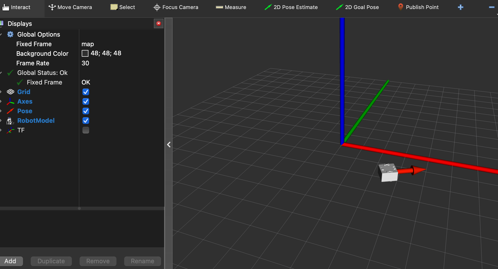
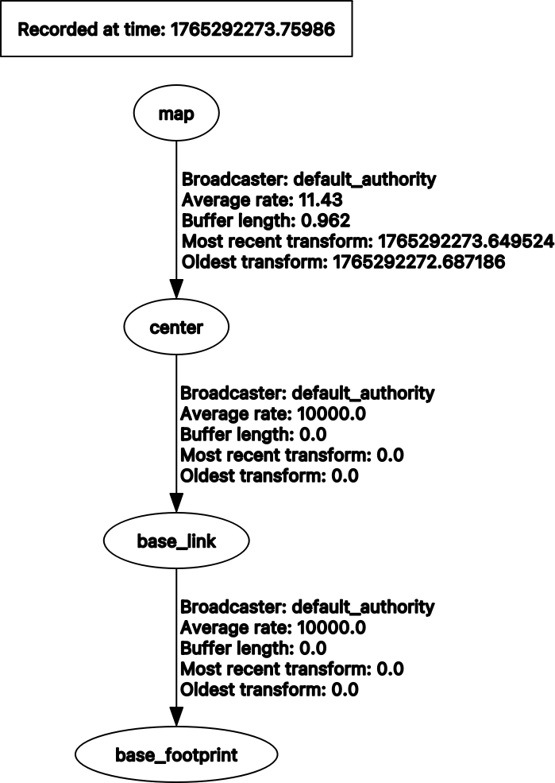

# toio_ros2

## Introduction

`toio_ros2` is ROS 2 package for using [toio](https://toio.io/).



## Requirements

### Hardware

- toio Core Cube
- toio play mat
  - Please see <https://toio.github.io/toio-spec/en/docs/hardware_position_id>.

### Software

I checked this package on the following environment.

- Ubuntu 24.04
- ROS 2 Jazzy
- toio.py 1.10.0

## Subscribed topics

|topic name|Type|Description|
|:---|:---|:---|
|/cmd_vel|[geometry_msgs/msg/Twist](https://docs.ros2.org/foxy/api/geometry_msgs/msg/Twist.html)|desired robot velocity|
|/goal_pose|[geometry_msgs/msg/PoseStamped](https://docs.ros2.org/foxy/api/geometry_msgs/msg/PoseStamped.html)|desired robot pose (cube built-in target motion; disabled when `enable_goal_pose_motion` is false)|
|/toio/led|[std_msgs/msg/ColorRGBA](https://docs.ros2.org/foxy/api/std_msgs/msg/ColorRGBA.html)|indicator color. `r`/`g`/`b` are 0.0-1.0 and scaled to the cube range of 0-255 (`a` is unused); all zero turns the indicator off|
|/toio/sound|[std_msgs/msg/UInt8](https://docs.ros2.org/foxy/api/std_msgs/msg/UInt8.html)|[sound effect ID](https://toio.github.io/toio-spec/docs/ble_sound) (0-10). An out-of-range ID is ignored with a warning|
|/toio/led_timed|[toio_msgs/msg/Led](https://github.com/atinfinity/toio_msgs)|indicator color with a per-command lighting time, for when `led_duration_ms` is not the same for every command|
|/toio/led_pattern|[toio_msgs/msg/LedPattern](https://github.com/atinfinity/toio_msgs)|blink sequence the cube plays on its own (up to 29 steps). `repeat` 0 repeats until the next indicator command. Rejected with a warning if it is empty or too long|
|/toio/melody|[toio_msgs/msg/Melody](https://github.com/atinfinity/toio_msgs)|MIDI melody the cube plays on its own (up to 59 notes, note 0-128 with 128 as a rest). Shares the sound throttle with `/toio/sound`|

## Published topics

|topic name|Type|Description|
|:---|:---|:---|
|/toio/pose|[geometry_msgs/msg/PoseStamped](https://docs.ros2.org/foxy/api/geometry_msgs/msg/PoseStamped.html)|toio pose in map frame|
|/toio/battery_state|[sensor_msgs/msg/BatteryState](https://docs.ros2.org/foxy/api/sensor_msgs/msg/BatteryState.html)|battery level of toio (`percentage` is 0.0-1.0). The cube notifies it in 10% steps, see the [toio spec](https://toio.github.io/toio-spec/docs/ble_battery)|
|/tf|-|a valid transform from `map` to `center`|

## Action servers

|action name|Type|Description|
|:---|:---|:---|
|/dock_to_pose|[nav2_msgs/action/NavigateToPose](https://github.com/ros-navigation/navigation2/blob/main/nav2_msgs/action/NavigateToPose.action)|precise final positioning with the cube built-in target motion. Unlike `/goal_pose` it reports the result, can be cancelled, and stays available when `enable_goal_pose_motion` is false (see below)|

`behavior_tree` in the goal is ignored; the cube runs its own motion. On success
`error_code` is `NONE` and `error_msg` carries the cube's response code name; on
failure `error_code` is the raw [motor response code](https://toio.github.io/toio-spec/en/docs/ble_motor#responses-to-motor-control-with-target-specified)
(1 timeout, 2 Position ID missed, 3 invalid parameter, 4 invalid cube state).
`SUCCESS_WITH_OVERWRITE` is reported as success with a warning: another motor
command preempted the target motion, so the cube may have stopped short.

Only one dock can be in flight. A second goal is rejected, and `goal_pose` is
ignored while docking, because the cube's motor response carries no usable
request id and could otherwise complete the wrong motion. `cmd_vel` is also
dropped for the duration rather than buffered, so a command from before the
dock cannot drive the cube off the pose it just reached.

### `goal_pose` vs `dock_to_pose`

`enable_goal_pose_motion: false` exists so that an external traffic authority
(Open-RMF) owns every motion plan: the `goal_pose` topic lets anyone make the
cube drive a built-in target motion along a path the planner does not know
about, at a time the planner did not choose. `dock_to_pose` is exempt because
it inverts all three properties - the traffic authority issues it itself, at a
waypoint it has already reserved, over a few centimetres, and it waits for the
result before doing anything else. It therefore stays available regardless of
`enable_goal_pose_motion`.

## Parameters

Default is a param for A4 mat. 
Please see <https://toio.github.io/toio-spec/docs/hardware_position_id> in detail.

|name|Type|Default|Description|
|:---|:---|:---|:---|
|field_min_x|double|98.0|minimum of `x` in field|
|field_max_x|double|402.0|maximum of `x` in field|
|field_min_y|double|142.0|minimum of `y` in field|
|field_max_y|double|358.0|maximum of `y` in field|
|field_width_meter|double|0.297|width of field(meter)|
|field_height_meter|double|0.210|height of field(meter)|
|goal_max_speed|int|30|maximum motor speed for the built-in target motion (`goal_pose` and `dock_to_pose`)|
|goal_timeout|int|60|timeout(second) for the built-in target motion (`goal_pose` and `dock_to_pose`)|
|goal_boundary_margin|int|10|margin(Position ID units) kept between a clamped goal and the mat boundary|
|cube_id|string|''|connect only to the cube whose BLE local name contains `cube_id`|
|cube_address|string|''|connect only to the cube with this BLE address|
|frame_prefix|string|''|prefix of the TF child frame (`<frame_prefix>center`) for multi-cube setups|
|enable_goal_pose_motion|bool|true|subscribe `goal_pose` and use the cube built-in target motion. Set to false when an external traffic authority (e.g. Open-RMF) owns the motion plan and all movement must go through Nav2 `cmd_vel`. Does not affect the `dock_to_pose` action|
|led_duration_ms|int|0|lighting time of `/toio/led`. 0 keeps the indicator lit until the next command, 10-2550 lets the cube turn it off on its own (a fraction below 10ms is truncated, anything above 2550ms is clipped)|
|sound_volume|int|255|volume of `/toio/sound`. Per the [toio spec](https://toio.github.io/toio-spec/docs/ble_sound) this is mute or full volume only: 0 is mute and every other value is the maximum volume|

Parameter files is stored in [params](params).
And, [launch/toio_ros2_bringup.launch.py](launch/toio_ros2_bringup.launch.py) load [params/toio_a4_play_mat_params.yaml](params/toio_a4_play_mat_params.yaml) as default.
Parameter files use the `/**/toio_ros2_node:` wildcard key so that they apply to the node in any namespace — both the plain single-cube launch and the per-robot namespaces (`/toio1`, `/toio2`, ...) of `toio_multi_bringup.launch.py`. A bare `toio_ros2_node:` key would only match the root namespace and be silently ignored by the namespaced nodes.


```python
declare_params_file_cmd = DeclareLaunchArgument(
    'params_file',
    default_value=os.path.join(toio_ros2_dir, 'params', 'toio_a4_play_mat_params.yaml'),
    description='Full path to the ROS2 parameters file to use toio_ros2 node')
```

## Build

```bash
mkdir -p ~/dev_ws/src
cd ~/dev_ws/src
git clone https://github.com/atinfinity/toio_description.git
git clone https://github.com/atinfinity/toio_msgs.git
git clone https://github.com/atinfinity/toio_ros2.git
cd ..
rosdep install -y -i --from-paths src
colcon build --symlink-install
source ~/dev_ws/install/setup.bash
```

## Launch toio_ros2

```bash
ros2 launch toio_ros2 toio_ros2_bringup.launch.py
```

## Connecting to a specific cube

By default (`cube_id` and `cube_address` are empty), the node connects to the
nearest cube found by the BLE scan. This is convenient when you have a single
cube, but with other cubes around you may connect to somebody else's cube.

To connect only to your own cube, set the `cube_id` parameter to the identifier
contained in the cube's BLE local name. The name format depends on the cube,
so take the `<cube_id>` part of whichever form your cube advertises:

- `toio Core Cube-<cube_id>` (e.g. `toio Core Cube-C7f` -> `C7f`)
- `toio-<cube_id> (toio Core Cube)` (e.g. `toio-a7D (toio Core Cube)` -> `a7D`)

The name of every cube found by the scan is printed in the node log at startup,
so you can find your `cube_id` there:

```
[INFO] [toio_ros2_node]: found cube: toio-a7D (toio Core Cube) (XXXXXXXX-...)
```

```bash
ros2 run toio_ros2 toio_ros2_node --ros-args -p cube_id:=a7D
```

`cube_id` is matched as a substring of the BLE local name, so use enough
characters to identify one cube: a short `cube_id` may match several cubes,
and the nearest match is used.

`cube_address` can be used instead to specify the BLE address directly, but
note that it is platform dependent: a MAC address on Linux/Windows and a
CoreBluetooth UUID on macOS. `cube_id` takes precedence when both are set.

## Using multiple cubes

Each cube is handled by its own node instance separated by a ROS namespace.
`toio_multi_bringup.launch.py` brings up one cube per namespace listed in
the `robots` argument (default `toio1,toio2`). For three or more cubes
pass `robots:=toio1,toio2,toio3 cube_ids:=a7D,A8e,B9f`. The example below
brings up two cubes in the namespaces `toio1`
and `toio2`. Specifying `cube_id` of every cube is mandatory here — without
it the two nodes would race for the same cube:

```bash
ros2 launch toio_ros2 toio_multi_bringup.launch.py cube1_id:=a7D cube2_id:=A8e
```

Topics are namespaced (`/toio1/cmd_vel`, `/toio1/toio/pose`, ...) and TF uses
one tree with the shared `map` frame and per-cube prefixed frames
(`toio1/center`, `toio2/center`, ...). RViz2 starts with
[rviz/toio_multi.rviz](rviz/toio_multi.rviz), which shows the pose and robot
model of both cubes (the "2D Goal Pose" tool sends to `/toio1/goal_pose`;
change the topic in the tool properties to command the other cube).

For three or more cubes, include `toio_ros2_bringup.launch.py` once per cube
with a unique `namespace` / `cube_id` / `frame_prefix`, following
[launch/toio_multi_bringup.launch.py](launch/toio_multi_bringup.launch.py).

## Teleop

```bash
ros2 run teleop_twist_keyboard teleop_twist_keyboard --ros-args -p speed:=0.1 -p turn:=3.0
```

## LED and sound

```bash
# light the indicator in red
ros2 topic pub --once /toio/led std_msgs/msg/ColorRGBA "{r: 1.0, g: 0.0, b: 0.0, a: 1.0}"

# play the 'Get1' sound effect
ros2 topic pub --once /toio/sound std_msgs/msg/UInt8 "{data: 6}"
```

Blink red for one second and off for one second, five times. The cube runs the
sequence itself, so it keeps its timing and survives a BLE dropout:

```bash
ros2 topic pub --once /toio/led_pattern toio_msgs/msg/LedPattern "{steps: [{color: {r: 1.0, g: 0.0, b: 0.0, a: 1.0}, duration_ms: 1000}, {color: {r: 0.0, g: 0.0, b: 0.0, a: 1.0}, duration_ms: 1000}], repeat: 5}"
```

Play three notes:

```bash
ros2 topic pub --once /toio/melody toio_msgs/msg/Melody "{notes: [{duration_ms: 400, note: 60, volume: 255}, {duration_ms: 400, note: 62, volume: 255}, {duration_ms: 400, note: 64, volume: 255}], repeat: 1}"
```

Light blue for three seconds, without sending an off command afterwards:

```bash
ros2 topic pub --once /toio/led_timed toio_msgs/msg/Led "{color: {r: 0.0, g: 0.0, b: 1.0, a: 1.0}, duration_ms: 3000}"

# turn the indicator off
ros2 topic pub --once /toio/led std_msgs/msg/ColorRGBA "{r: 0.0, g: 0.0, b: 0.0, a: 0.0}"
```

Both topics are relative names, so with `toio_multi_bringup.launch.py` they are
namespaced per cube (`/toio1/toio/led`, `/toio2/toio/led`, ...).
The sound effect IDs are the ones of the
[toio spec](https://toio.github.io/toio-spec/docs/ble_sound) (0:Enter, 1:Selected,
2:Cancel, 3:Cursor, 4:MatIn, 5:MatOut, 6:Get1, 7:Get2, 8:Get3, 9:Effect1, 10:Effect2).

## Frame


