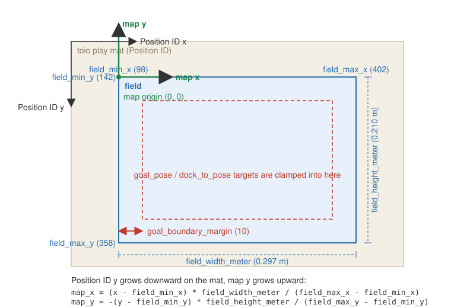

# ROS 2 interfaces

Topics, action servers and parameters of `toio_ros2_node`.

- [Subscribed topics](#subscribed-topics)
- [Published topics](#published-topics)
- [Action servers](#action-servers)
- [Parameters](#parameters)

## Subscribed topics

|topic name|Type|Description|
|:---|:---|:---|
|/cmd_vel|[geometry_msgs/msg/Twist](https://docs.ros2.org/foxy/api/geometry_msgs/msg/Twist.html)|desired robot velocity|
|/goal_pose|[geometry_msgs/msg/PoseStamped](https://docs.ros2.org/foxy/api/geometry_msgs/msg/PoseStamped.html)|desired robot pose (cube built-in target motion; disabled when `enable_goal_pose_motion` is false)|
|/toio/led|[std_msgs/msg/ColorRGBA](https://docs.ros2.org/foxy/api/std_msgs/msg/ColorRGBA.html)|indicator color. `r`/`g`/`b` are 0.0-1.0 and scaled to the cube range of 0-255 (`a` is unused); all zero turns the indicator off|
|/toio/sound|[std_msgs/msg/UInt8](https://docs.ros2.org/foxy/api/std_msgs/msg/UInt8.html)|[sound effect ID](https://toio.github.io/toio-spec/docs/ble_sound) (0-10). An out-of-range ID is ignored with a warning|
|/toio/led_timed|[toio_msgs/msg/Led](https://github.com/atinfinity/toio_msgs)|indicator color with a per-command lighting time, for when `led_duration_ms` is not the same for every command|
|/toio/led_pattern|[toio_msgs/msg/LedPattern](https://github.com/atinfinity/toio_msgs)|blink sequence the cube plays on its own (up to 29 steps). `repeat` 0 repeats until the next indicator command. Rejected with a warning if it is empty or too long|
|/toio/melody|[toio_msgs/msg/Melody](https://github.com/atinfinity/toio_msgs)|MIDI melody the cube plays on its own (up to 59 notes, note 0-128 with 128 as a rest). Shares the sound throttle with `/toio/sound`|

## Published topics

|topic name|Type|Description|
|:---|:---|:---|
|/toio/pose|[geometry_msgs/msg/PoseStamped](https://docs.ros2.org/foxy/api/geometry_msgs/msg/PoseStamped.html)|toio pose in map frame. Not published while the Position ID is missed (see `/toio/position_id_missed`)|
|/toio/position_id_missed|[std_msgs/msg/Bool](https://docs.ros2.org/foxy/api/std_msgs/msg/Bool.html)|`true` while the cube cannot read the mat (lifted, driven off the edge, standing on the border), `false` once it reads a Position ID again. Published on change only with a `TRANSIENT_LOCAL` QoS, so a late subscriber still gets the current state. Reset to `false` on every (re)connection. See the [toio spec](https://toio.github.io/toio-spec/docs/ble_id#position-id-missed)|
|/toio/battery_state|[sensor_msgs/msg/BatteryState](https://docs.ros2.org/foxy/api/sensor_msgs/msg/BatteryState.html)|battery level of toio (`percentage` is 0.0-1.0). The cube notifies it in 10% steps, see the [toio spec](https://toio.github.io/toio-spec/docs/ble_battery)|
|/toio/motion|[toio_msgs/msg/MotionDetection](https://github.com/atinfinity/toio_msgs)|motion detection: `horizontal`, `collision`, `double_tap`, `posture` and `shake`. Published when the cube reports a change, plus once on every (re)connection. `collision` and `double_tap` are momentary (`true` in the notification that detects them, `false` in the next), so treat them as events. See the [toio spec](https://toio.github.io/toio-spec/docs/ble_sensor)|
|/odom|[nav_msgs/msg/Odometry](https://docs.ros2.org/foxy/api/nav_msgs/msg/Odometry.html)|wheel odometry at 20Hz (`odom` → `center`), only when `publish_odom` is true. The twist is the cube's reported wheel speeds, the pose their integration. See [Odometry](#odometry)|
|/tf|-|`map` → `center`. With `publish_odom` (default) this goes through `odom`: `map` → `odom` is corrected from the Position ID and held while it is missed, `odom` → `center` is the wheel odometry. With `publish_odom: false` the node publishes `map` → `center` straight from the Position ID|

## Action servers

|action name|Type|Description|
|:---|:---|:---|
|/dock_to_pose|[nav2_msgs/action/NavigateToPose](https://github.com/ros-navigation/navigation2/blob/main/nav2_msgs/action/NavigateToPose.action)|precise final positioning with the cube built-in target motion. Unlike `/goal_pose` it reports the result, can be cancelled, and stays available when `enable_goal_pose_motion` is false (see below)|

`behavior_tree` in the goal is ignored; the cube runs its own motion. On success
`error_code` is `NONE` and `error_msg` carries the cube's response code name; on
failure `error_code` is the raw [motor response code](https://toio.github.io/toio-spec/en/docs/ble_motor#responses-to-motor-control-with-target-specified)
(1 timeout, 2 Position ID missed, 3 invalid parameter, 4 invalid cube state).
`SUCCESS_WITH_OVERWRITE` is reported as success with a warning: another motor
command preempted the target motion, so the cube may have stopped short.

Only one dock can be in flight. A second goal is rejected, and `goal_pose` is
ignored while docking, because the cube's motor response carries no usable
request id and could otherwise complete the wrong motion. `cmd_vel` is also
dropped for the duration rather than buffered, so a command from before the
dock cannot drive the cube off the pose it just reached.

### `goal_pose` vs `dock_to_pose`

`enable_goal_pose_motion: false` exists so that an external traffic authority
(Open-RMF) owns every motion plan: the `goal_pose` topic lets anyone make the
cube drive a built-in target motion along a path the planner does not know
about, at a time the planner did not choose. `dock_to_pose` is exempt because
it inverts all three properties - the traffic authority issues it itself, at a
waypoint it has already reserved, over a few centimetres, and it waits for the
result before doing anything else. It therefore stays available regardless of
`enable_goal_pose_motion`.

## Odometry

With `publish_odom` (the default) the node enables the cube's
[motor speed notification](https://toio.github.io/toio-spec/docs/ble_motor#モーターの速度情報の取得)
and dead-reckons a pose from it:

- `odom` → `center` and `/odom` are the integrated wheel speeds, published at 20Hz.
- `map` → `odom` is recomputed on every Position ID so that `map` → `center`
  matches the mat reading, and held while the Position ID is missed. The
  cube's pose therefore keeps moving from the wheel odometry over a gap in the
  mat reading instead of freezing.
- `/toio/pose` is still the raw Position ID in `map`, unchanged.

The cube reports the wheel speeds as **magnitudes only** (verified on a real
cube: reverse and spin-in-place both come back positive), so the node takes
the direction from the last motor command it sent. During a built-in target
motion (`goal_pose`, `dock_to_pose`) the cube drives itself and the direction
is a guess from the last `cmd_vel`; those motions are mostly forward, so a
stale reverse command before one is what misleads the odometry until the next
Position ID corrects it. The speeds also arrive only when they change (every
100ms at most), so the integration holds the last reported value in between.

Set `publish_odom: false` to get the previous TF tree (`map` → `center`
directly, no `odom` frame, no `/odom`).

## Parameters

Default is a param for A4 mat. 
Please see <https://toio.github.io/toio-spec/docs/hardware_position_id> in detail.



`field_min_*` / `field_max_*` are the Position ID range of the mat area used as
the field, and `field_width_meter` / `field_height_meter` its physical size. The
`map` frame has its origin at `(field_min_x, field_min_y)` with `x` pointing
along Position ID x and `y` pointing up (opposite to Position ID y, which grows
downward on the mat). A `goal_pose` / `dock_to_pose` target is clamped to stay
`goal_boundary_margin` Position ID units inside the field.

|name|Type|Default|Description|
|:---|:---|:---|:---|
|field_min_x|double|98.0|minimum of `x` in field|
|field_max_x|double|402.0|maximum of `x` in field|
|field_min_y|double|142.0|minimum of `y` in field|
|field_max_y|double|358.0|maximum of `y` in field|
|field_width_meter|double|0.297|width of field(meter)|
|field_height_meter|double|0.210|height of field(meter)|
|goal_max_speed|int|30|maximum motor speed for the built-in target motion (`goal_pose` and `dock_to_pose`)|
|goal_timeout|int|60|timeout(second) for a `goal_pose` motion|
|dock_timeout|int|10|timeout(second) for a `dock_to_pose` motion. Much shorter than `goal_timeout` because a dock covers a few centimetres: a cube that cannot reach the target, because something is standing on it, must give up quickly instead of pushing for a minute|
|goal_boundary_margin|int|10|margin(Position ID units) kept between a clamped goal and the mat boundary|
|cube_id|string|''|connect only to the cube whose BLE local name contains `cube_id`|
|cube_address|string|''|connect only to the cube with this BLE address|
|frame_prefix|string|''|prefix of the TF child frame (`<frame_prefix>center`) for multi-cube setups|
|stop_on_position_id_missed|bool|true|send a motor stop instead of `cmd_vel` while `/toio/position_id_missed` is `true`, so a cube that left the mat does not drive blind on the last pose Nav2 saw. The newest `cmd_vel` is kept and applied as soon as the mat is read again. `goal_pose` / `dock_to_pose` are unaffected: the cube's own target motion aborts with `Position ID missed` by itself|
|collision_threshold|int|7|collision detection sensitivity sent to the cube on every (re)connection, 1 (most sensitive) to 10. The cube default of 7 needs a fairly hard knock; lower it when `/toio/motion` is used to detect a bump against a wall at navigation speeds|
|horizontal_threshold|int|45|tilt in degrees beyond which `horizontal` in `/toio/motion` turns `false`, 1-45, sent to the cube on every (re)connection. The cube default of 45 only catches a cube nearly on its side; lower it to detect climbing onto another cube or a mat edge|
|publish_odom|bool|true|publish `/odom` and the `map` → `odom` → `center` TF tree from the cube's wheel speed notification. Set to false for the plain `map` → `center` transform|
|enable_goal_pose_motion|bool|true|subscribe `goal_pose` and use the cube built-in target motion. Set to false when an external traffic authority (e.g. Open-RMF) owns the motion plan and all movement must go through Nav2 `cmd_vel`. Does not affect the `dock_to_pose` action|
|led_duration_ms|int|0|lighting time of `/toio/led`. 0 keeps the indicator lit until the next command, 10-2550 lets the cube turn it off on its own (a fraction below 10ms is truncated, anything above 2550ms is clipped)|
|sound_volume|int|255|volume of `/toio/sound`. Per the [toio spec](https://toio.github.io/toio-spec/docs/ble_sound) this is mute or full volume only: 0 is mute and every other value is the maximum volume|

Parameter files is stored in [params](../params).
And, [launch/toio_ros2_bringup.launch.py](../launch/toio_ros2_bringup.launch.py) load [params/toio_a4_play_mat_params.yaml](../params/toio_a4_play_mat_params.yaml) as default.
Parameter files use the `/**/toio_ros2_node:` wildcard key so that they apply to the node in any namespace — both the plain single-cube launch and the per-robot namespaces (`/toio1`, `/toio2`, ...) of `toio_multi_bringup.launch.py`. A bare `toio_ros2_node:` key would only match the root namespace and be silently ignored by the namespaced nodes.


```python
declare_params_file_cmd = DeclareLaunchArgument(
    'params_file',
    default_value=os.path.join(toio_ros2_dir, 'params', 'toio_a4_play_mat_params.yaml'),
    description='Full path to the ROS2 parameters file to use toio_ros2 node')
```
